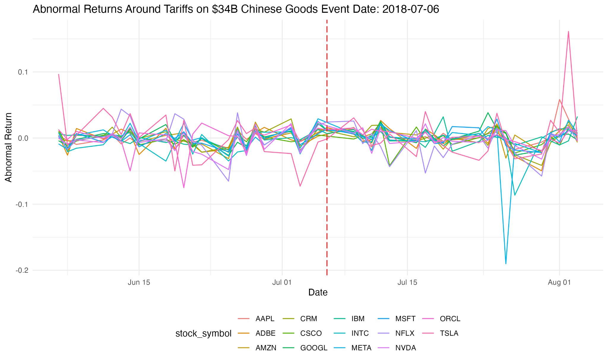
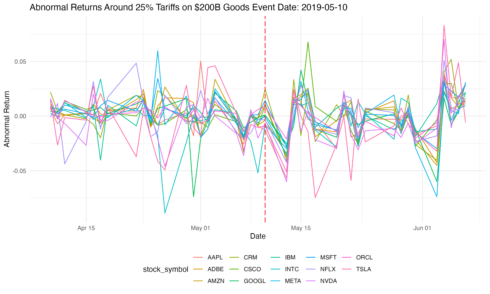
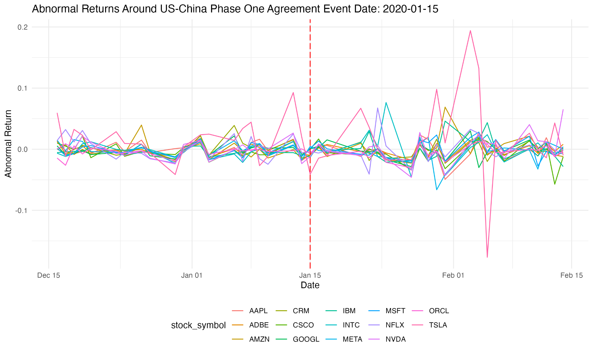
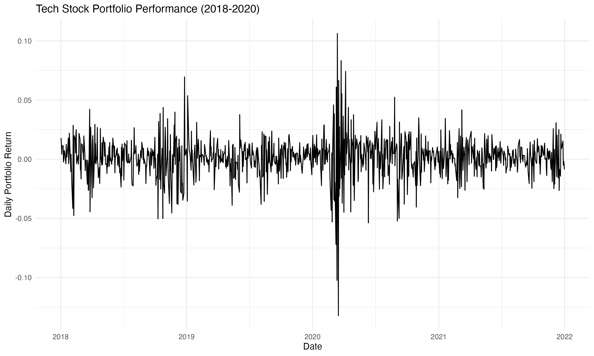
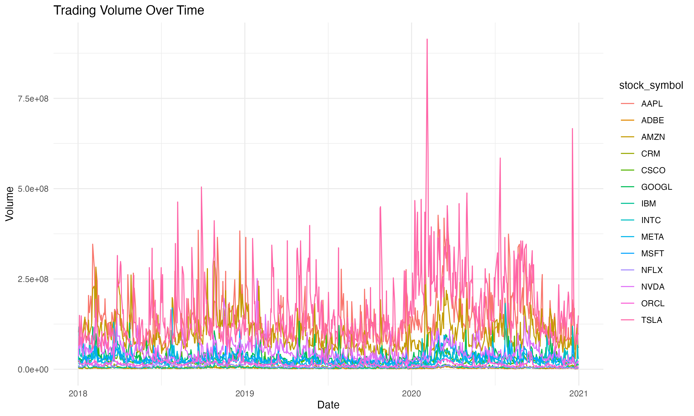
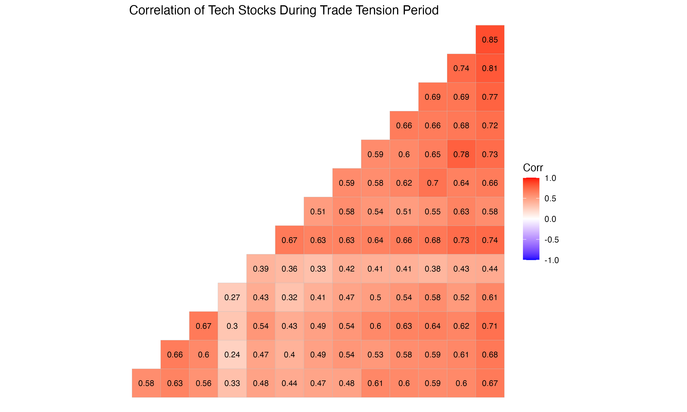

# Findings

## Overview

This document presents a detailed synthesis of the findings from an extensive analysis on the market volatility of the technology sector, particularly in response to the US-China trade tensions from 2018 to 2020. The aim was to uncover the nuanced effects of geopolitical developments on market behavior and the technology sector's performance.

## Event Study Analysis

### Tariffs on $34B Chinese Goods
The introduction of tariffs on $34 billion of Chinese goods led to an immediate but heterogeneous response among technology stocks. This period's event study showed some technology stocks saw a sharp increase in volatility, indicating market sensitivity to trade policy announcements, while others exhibited remarkable stability, possibly due to their less direct exposure to the tariffs imposed.

### 25% Tariffs on $200B Goods
When tariffs were raised to 25% on $200 billion worth of goods, the anticipated market disruption did not materialize in the expected magnitude. This stability could reflect the market's preemptive adjustments or a perception that such trade barriers would have limited long-term effect on the tech sector's robustness.

### US-China Phase One Agreement
The announcement of the US-China Phase One agreement heralded a positive shift in market sentiment, as evidenced by a general reduction in stock volatility. This effect underscored the market's favorable reception to the easing of trade tensions.

## Risk-Return Profile Analysis
The scatter plot examining the risk-return profiles during the trade tension period showed a broad spectrum of risk across different technology stocks. However, there was no discernible shift in risk-return profiles, indicating that the underlying business risks and returns of the tech sector remained intact despite geopolitical challenges.

## T-test and ANOVA Results
The Welch Two Sample t-test comparing daily returns between two leading tech companies yielded a p-value of 0.7965, indicating no significant difference in their average daily returns during the period under study. This non-result suggests that the trade tensions had a neutral effect on these companies' performance.

Additionally, ANOVA results with p-values well below the 0.05 threshold confirmed significant variations in volatility over different periods and among various stocks. This variability underlines the influence of both timing and individual company factors on market volatility.

## Beta Values
The beta analysis revealed that the majority of technology stocks had betas under 1, suggesting a volatility lower than the overall market. This finding was consistent throughout the trade tension timeline, proposing that the sector was not subjected to increased systemic risk due to the trade disputes. You may download the table of these Beta Values .

## Portfolio Performance
The simulated tech stock portfolio's performance remained robust, with a generally upward trajectory despite sporadic spikes in volatility during peak trade tension moments. This resilience might signal the sector's adaptability or the market's strategic responses to trade news.

## Liquidity Analysis
Measures of liquidity, inferred from price range and trading volume, showed no significant fluctuations corresponding to the trade event dates. This steadiness suggests that market liquidity for technology stocks was largely unaffected by trade tension escalations or resolutions.

## Correlation Analysis
Correlation matrices revealed that inter-stock correlations within the technology sector tended to increase during periods of high trade tension. This phenomenon points to a unification in stock responses to trade developments, potentially indicating a collective market assessment of trade news impacts. You can find the spreadsheet for this table .

Visual demonstration:

## Conclusion
The comprehensive analysis suggests that the technology sector, both at the individual stock level and collectively, weathered the US-China trade tensions without experiencing detrimental long-term impacts on average returns, risk profiles, or liquidity. This resilience could be interpreted as a sign that the market had effectively integrated trade tension expectations into pricing, or that the fundamental strengths of the technology sector afforded a buffer against such geopolitical uncertainties.
