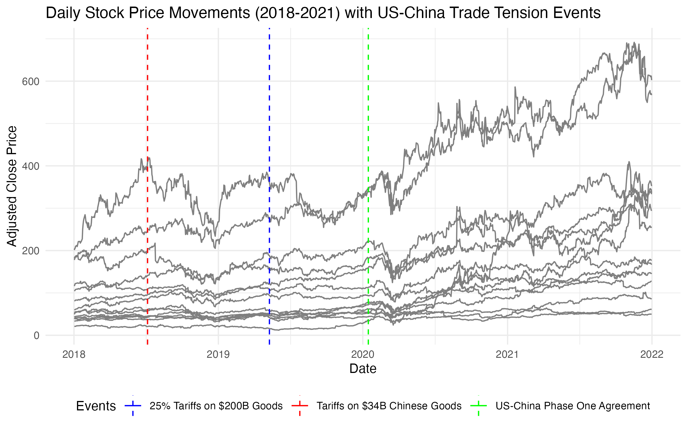
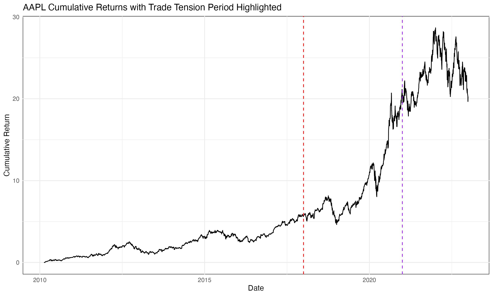
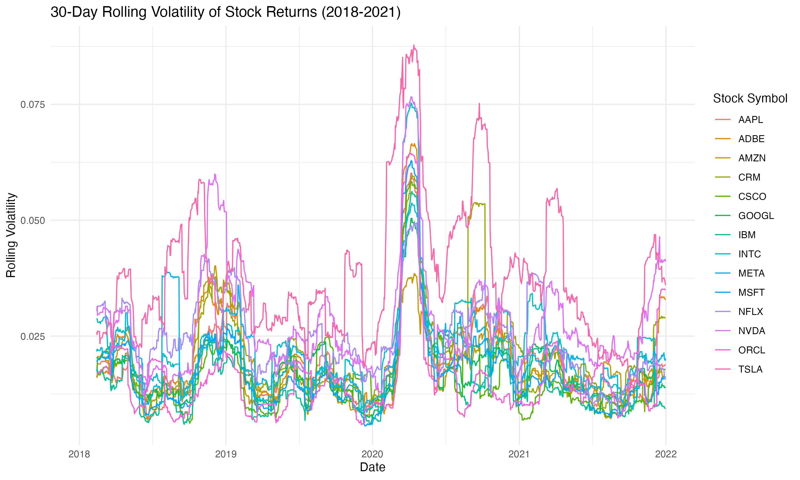
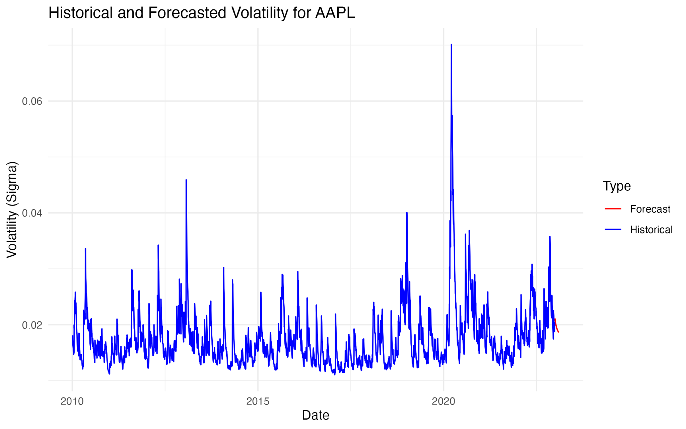

# Market Volatility Analysis: US-China Trade Tensions (2018-2020)

## Overview

This R project is designed to explore market volatility in the context of US-China trade tensions between 2018 and 2020. It provides a comprehensive analysis of 14 technology stocks, highlighting the geopolitical impact on market performance.

## Data Sources

Datasets used in this analysis are:

- S&P 500 historical data: [Kaggle](https://www.kaggle.com/datasets/henryhan117/sp-500-historical-data).
- Big Tech stock prices: [Kaggle](https://www.kaggle.com/datasets/evangower/big-tech-stock-prices).

## Components

- **Event Studies**: Analysis of stock performance surrounding key trade tension events.
- **Risk-Return Analysis**: Examines return patterns across different stocks.
- **Volatility Measurements**: Utilizes GARCH models for market risk assessment.
- **Liquidity Analysis**: Investigates market liquidity changes due to trade events.
- **Portfolio Simulation**: Analyzes overall performance of a tech stock portfolio.

## Prerequisites

Ensure R is installed with packages: `dplyr`, `tidyr`, `ggplot2`, `xts`, `rugarch`, etc.

## Running the Analysis

1. Clone/download the repository.
2. Load datasets into R from Kaggle.
3. Execute the R scripts in the presented order.

## Key Visualizations

### Event Study Analysis

Abnormal returns around trade-related events:  



### Cumulative Returns

Cumulative returns for a tech stock, highlighting trade tension impacts: 



### Rolling Volatility

Displays tech stocks' rolling volatility from 2018 to 2022:



*NOTE: Generated rolling volatility extends beyond project scope to verify plot functionality.*

## GARCH Model Usage

For GARCH modeling, here's an example, using AAPL stock data:

```R
# Load the rugarch package
library(rugarch)

# Filter AAPL data, run GARCH Model, plot volatility
aapl_data <- filter(data, stock_symbol == "AAPL")
garch_fit_aapl <- runGarchModel(aapl_data)
plotVolatility(garch_fit_aapl)
```

Here's how it should look like:



## Data Cleaning Script

Run this script to clean and prepare the tech stock price data. The datasets should be extracted to an "archive" folder within the working directory.

```r
library(fs)
library(tidyverse)
library(here)
library(janitor)

# Source for datasets
"https://www.kaggle.com/datasets/evangower/big-tech-stock-prices"

# Reading and cleaning stock prices data
big_tech_stock_prices_list <- purrr::map(
  fs::dir_ls(
    here::here("data", "2023", "2023-02-07", "archive"),
    glob = "*.csv"
  ),
  \(path) {
    ticker <- fs::path_file(path) |> fs::path_ext_remove()
    readr::read_csv(
      file = path,
      col_types = cols(
        Date = col_date(format = ""),
        Open = col_double(),
        High = col_double(),
        Low = col_double(),
        Close = col_double(),
        `Adj Close` = col_double(),
        Volume = col_double()
      )
    ) |> 
      dplyr::mutate(stock_symbol = ticker, .before = 1)
  }
)

big_tech_stock_prices <- purrr::list_rbind(big_tech_stock_prices_list) |> 
  janitor::clean_names()
dplyr::glimpse(big_tech_stock_prices)

# Writing the cleaned data to a CSV file
readr::write_csv(
  big_tech_stock_prices,
  here::here(
    "data", "2023", "2023-02-07",
    "big_tech_stock_prices.csv"
  )
)

# Counting the number of records for each stock symbol
big_tech_stock_prices |> 
  dplyr::count(stock_symbol, sort = TRUE)

# Creating a lookup table for the stock symbols and corresponding companies
tibble::tibble(
  stock_symbol = c(
    "AAPL",
    "ADBE",
    "AMZN",
    "CRM",
    "CSCO",
    "GOOGL",
    "IBM",
    "INTC",
    "META",
    "MSFT",
    "NFLX",
    "NVDA",
    "ORCL",
    "TSLA"
  ),
  company = c(
    "Apple Inc.",
    "Adobe Inc.",
    "Amazon.com, Inc.",
    "Salesforce, Inc.",
    "Cisco Systems, Inc.",
    "Alphabet Inc.",
    "International Business Machines Corporation",
    "Intel Corporation",
    "Meta Platforms, Inc.",
    "Microsoft Corporation",
    "Netflix, Inc.",
    "NVIDIA Corporation",
    "Oracle Corporation",
    "Tesla, Inc."
  )
) |> 
  readr::write_csv(
    here::here(
      "data", "2023", "2023-02-07",
      "big_tech_companies.csv"
    )
  )
```

## Deployment

* Execute analysis on any R-enabled machine. No special deployment steps required unless integrating into a Shiny app or similar platforms.

